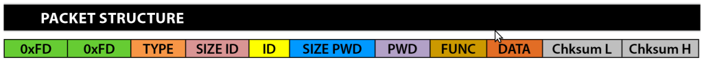

# Blauberg Vento Go Client

#### **This Project is currently in development**

Please do not expect anything to work yet.

### packet Structure

`0xFD|0xFD` denote the beginning of the packet to be sent. This means the first two bytes in the code will look like `FDFD`, hence why this is predefined already.

`TYPE` denotes the *protocol type*. This is set to `0x02` or just `02` in the Go code.

`SIZE ID` denotes the ID block size. This can be calculated by taking the length of your device ID and then returning the hexadecimal representation of it. As example, take the following id `014F10324C425708`. The length of this is 16 characters, and the hexadecimal respresentation of this is `0x10`, or in our case just `10`.

`ID` denotes the ID number printed on the label of the Blauberg Vento, this is 16 characters. You can also substitute the ID with `DEFAULT_DEVICEID` code word. In hexadecimal this would look like `44454641554c545f4445564943454944`

`SIZE PWD` denotes the password block size (1 byte). Say your password is `2222` as example, In hexadecimal the value would be `3204`.

`PWD` denotes the device password. The default value is `1111`. The hexadeciaml encoding of this would look like `31313131`.

`FUNC` defines the number of the action being taken with the data and the `DATA` block structure. Example of functions are:
  - `0x01` paramter read
  - `0x02` paramter write. The controller does not send any response regarding the status of the message.
  - `0x03` paramter write with controller response regarding stauts of message.
  - `0x04` paramter increment with controller response
  - `0x05` paramter decrement with controller response
  - `0x06` controller response to the request (FUNC = `0x01, 0x03, 0x04, 0x05`)
